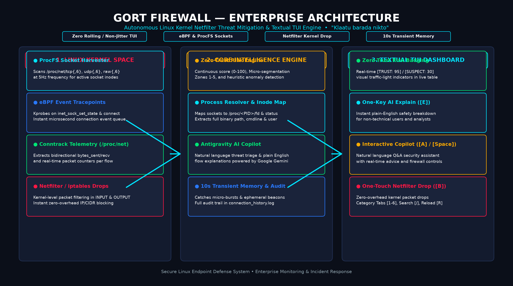
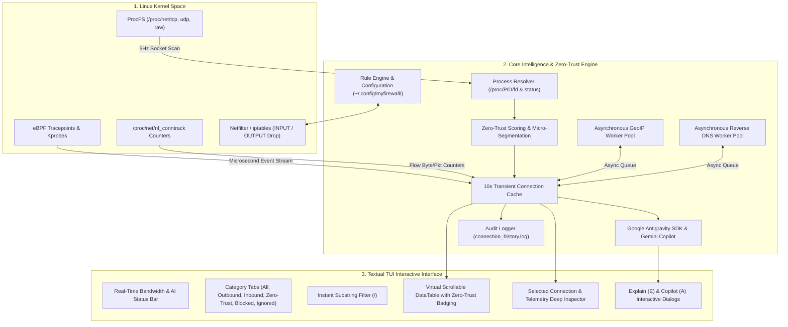

# 🤖 GORT Linux Firewall & Zero-Trust Monitor — Technical Architecture & Operational Manual

> **Autonomous Linux Endpoint Network Defense, Zero-Trust Risk Scoring, Real-Time Process Inspection, and Google Antigravity AI Security Copilot.**  
> *"Klaatu barada nikto"*

---

## 1. Executive Summary

**Gort Firewall** (`gort-firewall`) is an advanced security monitoring, Zero-Trust policy enforcement, and packet filtering platform for Linux workstations, servers, and cloud endpoints. Inspired by *Gort*—the autonomous robot sentinel from *The Day the Earth Stood Still*—Gort stands silent guard over your system's network perimeters, bridging low-level Linux Kernel Netfilter packet filtering with a modern, non-rolling **Textual Terminal User Interface (TUI)** and native integration with the **Google Antigravity SDK** (`google.antigravity`) and **Google Gemini**.

### Core Value Propositions:
* **Zero-Trust Continuous Verification:** Evaluates every network socket against dynamic Trust Scores (`0-100`), Micro-Segmentation Zones (1-5), and heuristic anomaly detectors.
* **Google Antigravity AI Security Copilot:** Embedded AI advisor translates complex technical telemetry into plain English for non-technical users (`[E]` key) and provides conversational network triage (`[A]` / `[Space]`).
* **Zero Viewport Rolling:** Eliminates terminal line-scrolling through an alternate-screen virtual scrolling engine.
* **Deep Process Telemetry:** Correlates kernel network sockets directly with process PIDs, full command line arguments, binary paths, system users, and socket inodes.
* **10-Second Transient Connection Memory:** Catches ephemeral network connections, data exfiltration bursts, and tracking beacons that open and close in milliseconds.
* **Kernel Netfilter Packet Drops:** Employs Linux `iptables` / Netfilter to drop malicious or unauthorized IP addresses with zero overhead.
* **Safe / Mock Mode:** Allows non-root users to perform live network audits without modifying kernel routing tables.

---

## 2. System Architecture & Infographic





---

## 3. Subsystem Breakdown

### 3.1 Zero-Trust Security & Risk Engine (`zero_trust_engine.py`)
Gort enforces a continuous verification model across 5 Micro-Segmentation Zones:
* **ZONE 1: LOOPBACK (Intra-Host)** — Inter-process communication (`127.0.0.1`, `::1`).
* **ZONE 2: LAN_PRIVATE (Local Trust Boundary)** — Private RFC 1918 subnets (`10.0.0.0/8`, `172.16.0.0/12`, `192.168.0.0/16`).
* **ZONE 3: TRUSTED_INFRA (Verified Infrastructure)** — Verified cloud/CDN providers (Google, AWS, Cloudflare, Fastly, Apple, Microsoft).
* **ZONE 4: PUBLIC_INTERNET (Untrusted External)** — General public internet addresses.
* **ZONE 5: HIGH_RISK (Anomalous / Suspicious)** — High-risk ports (e.g., 4444, 1337, 31337), unverified execution paths (`/tmp`, `/dev/shm`), and reverse-shell signatures.

#### Dynamic Trust Score (0–100) Algorithm:
* Starts at baseline `100`.
* Deducts points based on destination zone risk, missing reverse DNS, non-standard execution paths, high-risk ports, and suspicious command-line tokens.
* Maps to visual badges:
  - `🟢 TRUST: 80-100` (Safe)
  - `🟡 VERIFY: 50-79` (Unverified / Monitor)
  - `🔴 SUSPECT: 25-49` (Suspicious)
  - `🔥 THREAT: 0-24` (Critical Threat)

### 3.2 Antigravity AI Security Advisor & Copilot (`ai_advisor.py`)
* **Google Antigravity SDK Integration:** Uses `google.antigravity` and `Agent` to evaluate live network sockets with Google Gemini models.
* **Plain-English Explanations:** Translates process paths and reverse DNS into actionable explanations (e.g., *"This is Google Chrome syncing bookmarks. Safe."* vs. *"Unknown script uploading data to unverified foreign IP. Recommendation: Block."*).
* **Conversational Copilot Dialog (`A` / `Space`):** Real-time interactive security assistant for non-technical users.
* **Offline Heuristic Engine:** Seamlessly falls back to local heuristic explanations if offline or unauthenticated.

### 3.3 Socket Harvester (`network_monitor.py`)
Directly extracts raw hexadecimal socket tables from `/proc/net/tcp`, `/proc/net/tcp6`, `/proc/net/udp`, `/proc/net/udp6`, `/proc/net/raw`, and `/proc/net/raw6`.
* **State Filtering:** Identifies established TCP streams (`01`) and active UDP/RAW descriptors while ignoring unbound wildcard listeners (`0.0.0.0:0`).
* **Direction Resolution:** Compares local socket ports against active listening ports to classify flows as `INBOUND` or `OUTBOUND`.

### 3.4 Process Correlator (`process_resolver.py`)
Traverses `/proc/<PID>/fd/` to map kernel socket inodes (`socket:[12345]`) back to userland processes.
* **Executable Resolution:** Reads symlinks from `/proc/<PID>/exe`.
* **Command Line Extraction:** Parses null-byte-separated argument vectors from `/proc/<PID>/cmdline`.
* **User Identification:** Extracts process UID and maps it via `pwd.getpwuid()` to the owning username.

### 3.5 Kernel Netfilter Firewall Manager (`firewall_manager.py`)
* **Rule Generation:** Injects `iptables -I INPUT -s <IP> -j DROP` and `iptables -I OUTPUT -d <IP> -j DROP` rules.
* **Mock Isolation:** If executed without root/sudo, rules are managed in memory without calling `iptables`, allowing safe demonstration and threat audits.

### 3.6 Textual Terminal User Interface (`myfirewall2.py`)
* **Hardware-Accelerated DataTable:** Renders connection rows in the terminal alternate screen buffer (`\033[?1049h`).
* **In-Place Cell Updates:** Syncs row states by key every `0.5s` without resetting cursor selection.
* **Zero-Trust Alerts Tab (`4`):** Isolates suspicious or unverified connections with one keypress.
* **Selected Connection Inspector:** Displays full process arguments, socket states, inode numbers, and bandwidth metrics for highlighted connections.

---

## 4. Interactive Keyboard & Mouse Controls

| Key / Control | Action | Scope |
|---|---|---|
| `↑` / `↓` / `k` / `j` | Navigate up / down connection list | Main Table |
| `PageUp` / `PageDown` | Fast scroll page up / down | Main Table |
| `Home` / `End` | Jump to top / bottom of connection list | Main Table |
| `Mouse Scroll` | Smooth scroll through active connections | Main Table |
| `E` / `e` | **Explain with AI** (Antigravity SDK & Zero-Trust Breakdown) | Global |
| `A` / `a` / `Space` | **Ask Gort Copilot** (Interactive AI Security Assistant) | Global |
| `B` / `b` | Toggle Block on selected IP (or enter manual IP/CIDR) | Global |
| `I` / `i` | Toggle Ignore on selected process name or IP | Global |
| `/` | Focus search bar to filter live feed | Global |
| `Esc` | Clear search filter & return focus to table | Global |
| `1` | Switch to **All Connections** tab | Global |
| `2` | Switch to **Outbound Only** tab | Global |
| `3` | Switch to **Inbound Only** tab | Global |
| `4` | Switch to **Zero-Trust Alerts** tab | Global |
| `5` | Switch to **Blocked Rules** tab | Global |
| `6` | Switch to **Ignored Rules** tab | Global |
| `R` / `r` | Reload firewall rules from disk | Global |
| `H` / `?` | Show interactive help modal | Global |
| `Q` / `Ctrl+C` | Graceful application shutdown & state save | Global |

---

## 5. Persistence & Audit Logging

### Configuration Storage
Firewall rules, process ignore lists, and CIDR subnets are stored in standard JSON format:
```json
{
  "blocked_ips": [
    "185.190.140.2",
    "45.142.195.10"
  ],
  "ignored_ips": [
    "1.1.1.1"
  ],
  "ignored_names": [
    "chrome",
    "code"
  ],
  "ignored_cidrs": [
    "10.0.0.0/8",
    "192.168.0.0/16"
  ]
}
```
* Path: `~/.config/myfirewall/rules.json`

### Audit & Incident Trail
Every terminated or closed network flow is recorded in `connection_history.log`:
```text
[2026-08-21 21:30:10 -> 2026-08-21 21:32:15] (125s) Proto: TCP | Dir: OUTBOUND | Local: 192.168.1.50:49202 | Remote: 142.250.190.46:443 | ProcName: chrome | PID: 12450 | User: aug20 | Exe: /usr/bin/google-chrome | Cmd: /opt/google/chrome/chrome --type=utility | TxBytes: 14.20 KB (120 pkts) | RxBytes: 250.10 KB (410 pkts)
```

---

## 6. Execution Modes & Launcher

Launch using the unified launcher script [run.sh](file:///home/aug20/myfirewall-linux/run.sh) (or `./gort.sh`):

```bash
# 1. Active Security Mode (Netfilter kernel packet enforcement + Zero-Trust + AI)
sudo ./run.sh

# 2. Monitor-Only Safe Mode (Unprivileged audit)
./run.sh --mock

# 3. Setup Virtual Environment & Dependencies
./run.sh --install

# 4. Run Automated Test Suite
./run.sh --test
```

---

## 7. Quality Assurance & Automated Testing

Gort includes an automated test suite covering network socket parsing, firewall rule lifecycle, event queues, Zero-Trust scoring, and AI advisors:

```bash
./run.sh --test
```
