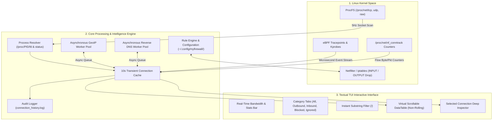

# 🛡️ MyFirewall Linux — Technical Architecture & Operational Guide

> **Enterprise Linux Endpoint Network Monitoring, Real-Time Connection Inspection, and Kernel Netfilter Packet Enforcement Engine.**

---

## 1. Executive Summary

**MyFirewall** is a security monitoring and packet filtering platform for Linux workstations, servers, and cloud endpoints. Designed for security analysts, journalists, researchers, developers, and administrators, MyFirewall bridges low-level Linux Kernel Netfilter packet filtering with a modern, non-rolling **Textual Terminal User Interface (TUI)**.

### Core Value Propositions:
* **Zero Viewport Rolling:** Eliminates terminal line-scrolling through an alternate-screen virtual scrolling engine.
* **Deep Process Telemetry:** Correlates kernel network sockets directly with process PIDs, full command line arguments, binary paths, system users, and socket inodes.
* **10-Second Transient Connection Memory:** Catches ephemeral network connections and tracking beacons that open and close in milliseconds.
* **Kernel Netfilter Packet Drops:** Employs Linux `iptables` / Netfilter to drop malicious or unauthorized IP addresses with zero overhead.
* **Safe / Mock Mode:** Allows non-root users to perform live network audits without modifying kernel routing tables.

---

## 2. System Architecture & Infographic




---

## 3. Subsystem Breakdown

### 3.1 Socket Harvester (`network_monitor.py`)
Directly extracts raw hexadecimal socket tables from `/proc/net/tcp`, `/proc/net/tcp6`, `/proc/net/udp`, `/proc/net/udp6`, `/proc/net/raw`, and `/proc/net/raw6`.
* **State Filtering:** Identifies established TCP streams (`01`) and active UDP/RAW descriptors while ignoring unbound wildcard listeners (`0.0.0.0:0`).
* **Direction Resolution:** Compares local socket ports against the set of active listening ports to classify flows as `INBOUND` or `OUTBOUND`.

### 3.2 Process Correlator (`process_resolver.py`)
Traverses `/proc/<PID>/fd/` to map kernel socket inodes (`socket:[12345]`) back to userland processes.
* **Executable Resolution:** Reads symlinks from `/proc/<PID>/exe`.
* **Command Line Extraction:** Parses null-byte-separated argument vectors from `/proc/<PID>/cmdline`.
* **User Identification:** Extracts process UID and maps it via `pwd.getpwuid()` to the owning username.

### 3.3 Asynchronous Telemetry & Geolocation Workers (`myfirewall_core.py`)
To keep the TUI rendering loop at 60 FPS without blocking on network I/O:
* **GeoIP Queue:** Background thread processes outbound public IPs using asynchronous rate-limited API calls.
* **Reverse DNS Queue:** Background thread resolves hostname records via system resolver caches.
* **Bandwidth Meter:** Derives real-time Rx/Tx byte rates from `psutil.net_io_counters()`.

### 3.4 Kernel Netfilter Firewall Manager (`firewall_manager.py`)
* **Rule Generation:** Injects `iptables -I INPUT -s <IP> -j DROP` and `iptables -I OUTPUT -d <IP> -j DROP` rules.
* **Mock Isolation:** If executed without root/sudo, rules are managed in memory without calling `iptables`, allowing safe demonstration and threat audits.

### 3.5 Textual Terminal User Interface (`myfirewall2.py`)
* **Hardware-Accelerated DataTable:** Renders connection rows in the terminal alternate screen buffer (`\033[?1049h`).
* **In-Place Cell Updates:** Syncs row states by key every `0.5s` without resetting cursor selection.
* **Responsive Inspector:** Displays full process arguments, socket states, inode numbers, and bandwidth metrics for the highlighted connection.

---

## 4. Interactive Keyboard & Mouse Controls

| Key / Control | Action | Scope |
|---|---|---|
| `↑` / `↓` / `k` / `j` | Navigate up / down connection list | Main Table |
| `PageUp` / `PageDown` | Fast scroll page up / down | Main Table |
| `Home` / `End` | Jump to top / bottom of connection list | Main Table |
| `Mouse Scroll` | Smooth scroll through active connections | Main Table |
| `B` / `b` | Toggle Block on selected IP (or enter manual IP/CIDR) | Global |
| `I` / `i` | Toggle Ignore on selected process name or IP | Global |
| `/` | Focus search bar to filter live feed | Global |
| `Esc` | Clear search filter & return focus to table | Global |
| `1` | Switch to **All Connections** tab | Global |
| `2` | Switch to **Outbound Only** tab | Global |
| `3` | Switch to **Inbound Only** tab | Global |
| `4` | Switch to **Blocked Rules** tab | Global |
| `5` | Switch to **Ignored Rules** tab | Global |
| `R` / `r` | Reload firewall rules from disk | Global |
| `H` / `?` | Show interactive help modal | Global |
| `Q` / `Ctrl+C` | Graceful application shutdown & state save | Global |

---

## 5. Persistence & Audit Logging

### Configuration Storage
Firewall rules, process ignore lists, and CIDR subnets are stored in standard JSON format:
```json
{
  "blocked_ips": [
    "185.190.140.2",
    "45.142.195.10"
  ],
  "ignored_ips": [
    "1.1.1.1"
  ],
  "ignored_names": [
    "chrome",
    "code"
  ],
  "ignored_cidrs": [
    "10.0.0.0/8",
    "192.168.0.0/16"
  ]
}
```
* Path: `~/.config/myfirewall/rules.json`

### Audit & Incident Trail
Every terminated or closed network flow is recorded in `connection_history.log`:
```text
[2026-08-21 21:30:10 -> 2026-08-21 21:32:15] (125s) Proto: TCP | Dir: OUTBOUND | Local: 192.168.1.50:49202 | Remote: 142.250.190.46:443 | ProcName: chrome | PID: 12450 | User: aug20 | Exe: /usr/bin/google-chrome | Cmd: /opt/google/chrome/chrome --type=utility | TxBytes: 14.20 KB (120 pkts) | RxBytes: 250.10 KB (410 pkts)
```

---

## 6. Execution Modes & Launcher

Launch using the unified launcher script [run.sh](file:///home/aug20/myfirewall-linux/run.sh):

```bash
# 1. Active Security Mode (Netfilter kernel packet enforcement)
sudo ./run.sh

# 2. Monitor-Only Safe Mode (Unprivileged audit)
./run.sh --mock

# 3. Setup Virtual Environment & Dependencies
./run.sh --install

# 4. Run Automated Test Suite
./run.sh --test
```

---

## 7. Quality Assurance & Automated Testing

MyFirewall includes an automated test suite covering network socket parsing, firewall rule lifecycle, event queues, and history serialization:

```bash
python3 test_network_monitor.py
python3 test_firewall_manager.py
python3 test_connection_history.py
python3 test_event_monitors.py
```
