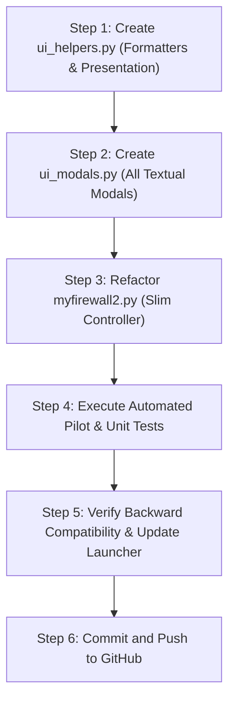

# 🏗️ GORT Firewall — UI & Core Decoupling Implementation Plan

> **Objective:** Refactor the monolithic `myfirewall2.py` into a clean, modular architecture separating UI presentation, modal dialogs, formatting helpers, and core security orchestration.

---

## 1. Architectural Strategy (Separation of Concerns)

Currently, `myfirewall2.py` combines Textual CSS, five distinct modal dialogs, text/rate formatters, table rendering, row diffing, and application lifecycle in a single 950-line file.

We will partition the frontend into focused, single-responsibility modules:

```
gort-firewall/
│
├── ui_helpers.py             # Pure UI utility functions & formatters (duration, rates, badges)
├── ui_modals.py              # Textual Modal Screens (Block, Ignore, AI Explain, Copilot, Help)
├── myfirewall2.py (or ui_app)# Slim, decoupled Textual Application coordinator (~250 lines)
│
├── zero_trust_engine.py      # Core Zero-Trust scoring, zone classification & anomaly heuristics
├── ai_advisor.py             # Google Antigravity SDK & Gemini Copilot advisor
├── myfirewall_core.py        # Background telemetry workers, caching, and state engine
├── process_resolver.py       # Kernel /proc socket-to-process resolver
└── firewall_manager.py       # Linux Netfilter / iptables packet drop manager
```

---

## 2. Module Boundaries & Responsibilities

### Module A: `ui_helpers.py` (Formatting & Presentation Helpers)
* **Purpose:** Stateless presentation formatters that transform raw numbers into human-readable strings.
* **Exports:**
  - `fmt_duration(first_seen: float) -> str`: Formats timestamp into `12s`, `4m15s`, `1h02m`.
  - `fmt_pkts(n: Optional[int]) -> str`: Compact packet counts (`1.2K`, `4.5M`, `—`).
  - `fmt_bytes_rate(rate: float) -> str`: Formats transfer rates (`12.4 KB/s`, `1.50 MB/s`).

### Module B: `ui_modals.py` (Interactive Textual Modal Screens)
* **Purpose:** Encapsulates all popup dialogs, their CSS styling, user inputs, and asynchronous worker tasks.
* **Exports:**
  - `BlockModal`: Netfilter IP & CIDR blocking prompt.
  - `IgnoreModal`: Process name & subnet ignore policy prompt.
  - `ExplainModal`: Antigravity AI + Zero-Trust plain-English breakdown with background worker.
  - `CopilotModal`: Interactive conversational AI security copilot chat interface.
  - `HelpModal`: Keyboard shortcuts and command reference dialog.

### Module C: `myfirewall2.py` (Application Controller)
* **Purpose:** Coordinates the primary layout, user input routing, reactive state, and live table data diffing.
* **Responsibilities:**
  - Composing layout (`Header`, `Tabs`, `Search Input`, `DataTable`, `Inspector`, `Footer`).
  - Managing reactive properties (`active_tab`, `filter_query`, `selected_conn`).
  - 0.5s periodic table sync with in-place cell updates.
  - Delegating modal actions to `ui_modals.py`.

---

## 3. Step-by-Step Execution Plan



1. **Step 1:** Extract `fmt_duration`, `fmt_pkts`, and `fmt_bytes_rate` into `ui_helpers.py`.
2. **Step 2:** Extract `BlockModal`, `IgnoreModal`, `ExplainModal`, `CopilotModal`, and `HelpModal` into `ui_modals.py`.
3. **Step 3:** Refactor `myfirewall2.py` to import from `ui_helpers` and `ui_modals`, streamlining its logic down to ~250 lines.
4. **Step 4:** Run automated Textual pilot tests to verify all modals, tabs, keybindings, and table rendering work identically.
5. **Step 5:** Run `./run.sh --test` to confirm the entire test suite passes with zero regressions.
6. **Step 6:** Commit changes with descriptive messages and push to GitHub.

---

## 4. Verification & Quality Assurance

* **Pilot Testing:** Run automated Textual pilot headless tests covering modal opening (`E`, `A`, `B`, `I`, `H`), tab switching (`1-6`), and search filtering.
* **Non-Rolling UI Integrity:** Ensure alternate screen buffer rendering and row-key cell update mechanics remain completely intact.
* **Zero Dependency Regressions:** Keep all public symbols accessible for backward compatibility.
